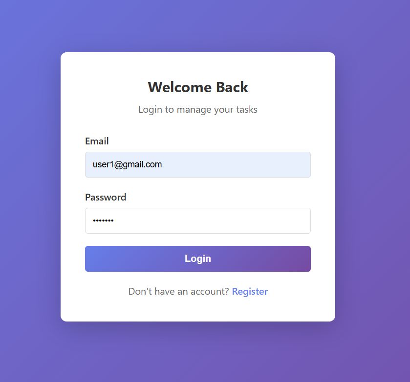
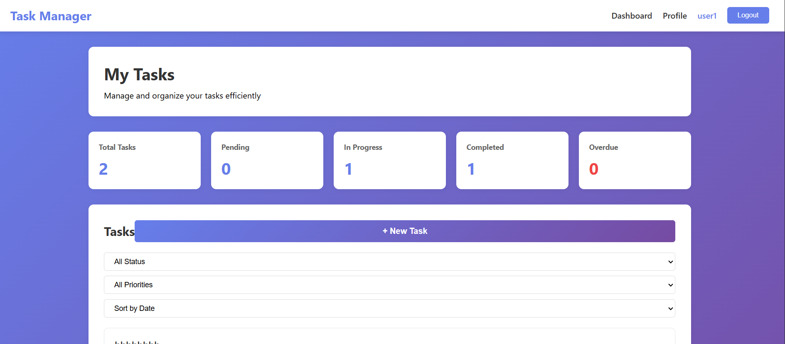
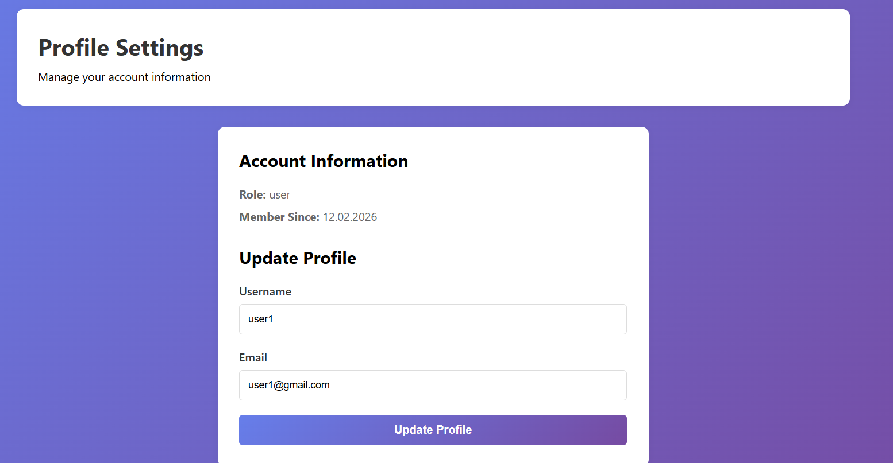
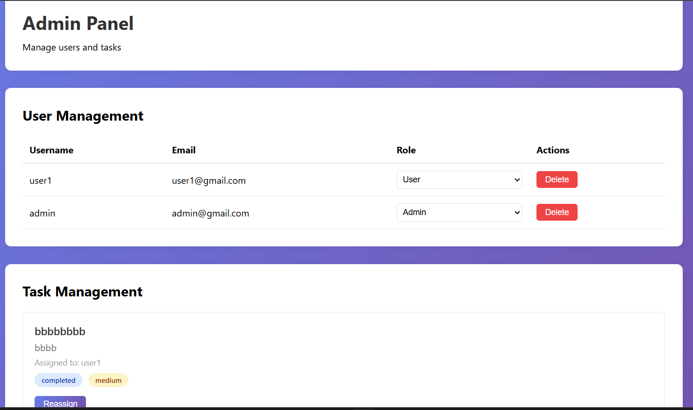

# Task Manager - Full Stack Application

A complete task management application with user authentication, role-based access control, and email notifications.

## Features

### Core Features
- User registration and authentication with JWT
- Email verification system
- Password reset functionality
- Role-Based Access Control (RBAC): Admin, Moderator, User
- Task CRUD operations
- Task filtering and sorting
# Task Manager — Full Stack Application

A task management web application with user authentication, role-based access control (user/admin), task CRUD and assignment, and a React front-end.

## Quick Features
- User registration and login (JWT)
- Password reset (token flow; email sending disabled)
- Role-based access (admin)
- Task create / read / update / delete
- Task assignment (admin)
- User profile and admin panel

## Tech Stack

- Backend: Node.js, Express, MongoDB (Mongoose)
- Frontend: React (Create React App), Axios
- Auth: JWT, bcrypt

## Repository Layout

Root files and folders:

```
package.json          # backend project (root entry: backend/server.js)
backend/              # Express API
frontend/             # Create React App
README.md
.env (local backend env)
```

Important backend folders:

```
backend/
    config/             # database.js, emailService.js (email stubs)
    controllers/        # authController.js, userController.js, taskController.js
    middleware/         # authMiddleware.js, validation.js, errorHandler.js
    models/             # User.js, Task.js
    routes/             # authRoutes.js, userRoutes.js, taskRoutes.js
    server.js
```

Important frontend folders:

```
frontend/
    public/
    src/
        components/       # Navbar, PrivateRoute, AdminRoute
        contexts/         # AuthContext
        pages/            # Dashboard, Profile, Login, Register, AdminPanel
        services/         # api.js (axios instance)
```

## Environment variables

Backend (set these for production and on Render):

- `MONGODB_URI` — MongoDB connection string (required)
- `JWT_SECRET` — strong secret for signing JWTs (required)
- `FRONTEND_URL` — deployed frontend origin (used by CORS)
- `PORT` — optional

Frontend (CRA build-time env; set on your static host before build):

- `REACT_APP_API_URL` — e.g. `https://your-backend.onrender.com/api`

Security note: do not commit secrets to the repo; set them in the host provider (Render, Vercel, Netlify, etc.).

## Run locally

Backend (from repo root):

```bash
cd backend
npm install
# create a .env (see .env.example)
npm run dev
```

Frontend:

```bash
cd frontend
npm install
# set REACT_APP_API_URL in frontend/.env (e.g. http://localhost:5000/api)
npm start
```

## Key API endpoints

- `POST /api/auth/register` — register (response includes `user.createdAt`)
- `POST /api/auth/login` — login
- `GET /api/users/profile` — get current user profile
- `GET /api/tasks` — list tasks (authenticated)
- `POST /api/tasks` — create task (authenticated)

Refer to the code in `backend/controllers` and `frontend/services/api.js` for full details.

## Deployment notes (Render)

- Backend: create a Web Service on Render, connect the repo, set build command `npm install` and start command `npm start`. Add `MONGODB_URI`, `JWT_SECRET`, and `FRONTEND_URL` in the Environment settings. Ensure `MONGODB_URI` is exactly named (typos like `MONGO_URI` will break the DB connection).
- Frontend: create a Static Site on Render (or use Vercel/Netlify). Set Build Command to `npm install && npm run build` and Publish Directory to `build`. Add `REACT_APP_API_URL` in the Static Site Environment so it's available at build time.

## Testing the app

1. Register a new user, then login.
2. Create tasks from the Dashboard.
3. As an admin, visit the Admin Panel to manage users and assign tasks.
4. Verify the Profile page shows `Member Since:` with a valid date.

## Screenshots (placeholders)

Create a folder `screenshots/` in the repo or `frontend/public/screenshots/` and add images with the filenames below. Replace the example links with your actual screenshots.

- Login / Register
    - Screenshot: 
    - Description: User can register and login; tokens stored in `localStorage`.

- Dashboard (tasks list)
    - Screenshot: 
    - Description: Shows tasks, filters, sorting, and create task form.

- Create / Edit Task
    - Screenshot: 
    - Description: Task creation/editing UI with due date and priority.

- Profile
    - Screenshot: 
    - Description: Account information and "Member Since" date.

- Admin Panel
    - Screenshot: 
    - Description: User list, role changes, and task assignment.

